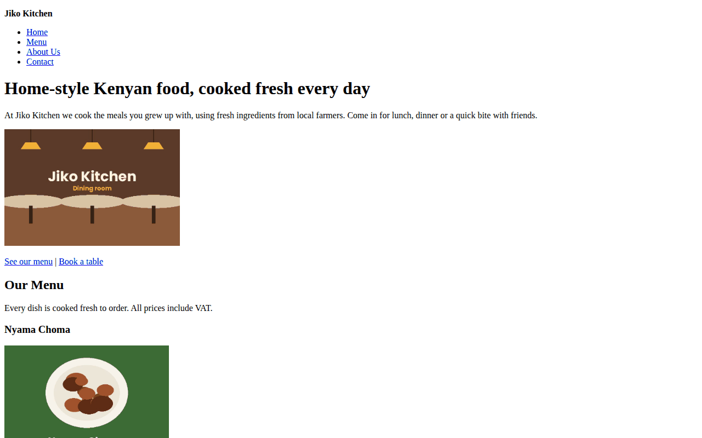
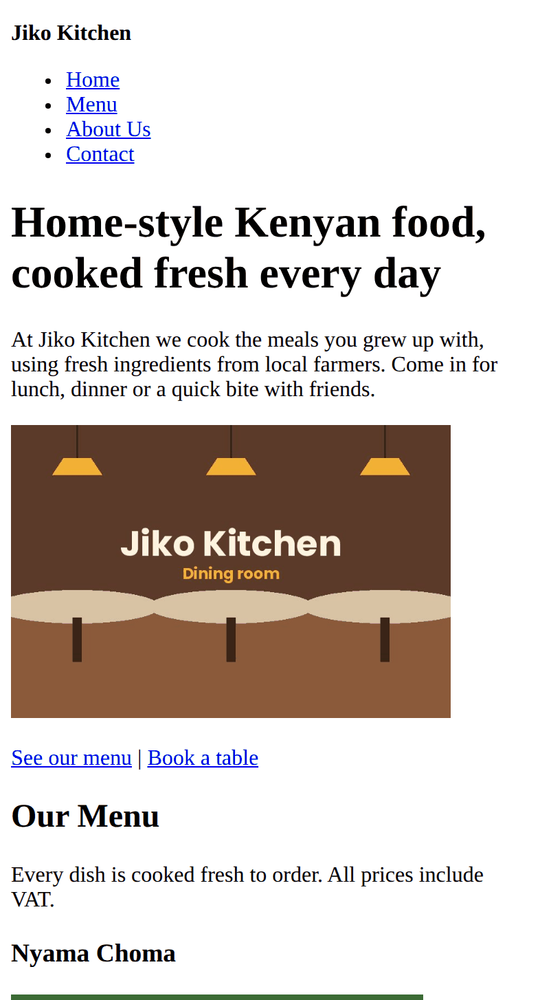

# Jiko Kitchen Landing Page

A one-page website for **Jiko Kitchen**, a fictional restaurant in Kilimani, Nairobi that serves home-style Kenyan food.

**Live site:** https://ceciliawambui.github.io/jiko-kitchen/

## Project Brief

Jiko Kitchen needs a simple online presence where customers can:

- Find out what the restaurant offers and what makes it different
- See the menu with prices
- Learn about the story and the team behind the food
- Find the location, phone number and opening hours
- Send a message to book a table or ask about catering

The site is a single landing page built with HTML only. The navigation menu jumps to each section on the page.

## Business Rationale

Many small restaurants in Nairobi rely only on walk-in customers and word of mouth. A website lets new customers find Jiko Kitchen online, check the menu and prices before they visit, and get in touch without needing to call.

- **Hero section:** tells visitors in one line what Jiko Kitchen offers, then points them to the menu or the booking form.
- **Menu section:** shows the main dishes with a photo, a short description and a price, so customers know what to expect.
- **About and team section:** builds trust by sharing the restaurant's story and the people who cook and serve the food.
- **Contact section:** gives the address, phone, email and opening hours, plus a form for bookings, catering and feedback.
- **Footer:** links to social media so customers can follow the restaurant.

## Technologies Used

- HTML5
- Git and GitHub for version control
- GitHub Pages for hosting
- Visual Studio Code

## Project Structure

```
jiko-kitchen/
├── index.html
├── README.md
├── images/
│   ├── hero-dining-room.jpg
│   ├── nyama-choma.jpg
│   ├── pilau.jpg
│   ├── chapati-beans.jpg
│   ├── team-achieng.jpg
│   ├── team-kamau.jpg
│   └── team-njeri.jpg
├── videos/
│   └── kitchen-tour.mp4
└── screenshots/
    ├── desktop.png
    └── mobile.png
```

## Setup Instructions

### Run it on your computer

1. Clone the repository:
   ```bash
   git clone https://ceciliawambui.github.io/jiko-kitchen/
   ```
2. Go into the project folder:
   ```bash
   cd jiko-kitchen
   ```
3. Open `index.html` in your browser (Chrome, Firefox or Safari). You can also right-click `index.html` in VS Code and choose **Open with Live Server**.

### Deploy to GitHub Pages

1. Push the project to a GitHub repository.
2. In the repository, go to **Settings** → **Pages**.
3. Under **Branch**, choose `main` and the `/ (root)` folder, then click **Save**.
4. Wait a minute or two, then open `https://ceciliawambui.github.io/jiko-kitchen/`.

## Screenshots

### Desktop



### Mobile



## Accessibility and SEO

- Every image has alt text that describes what is in it.
- The navigation and social links have `aria-label`s for screen readers.
- Every form field has a `<label>` connected to it with `for` and `id`.
- The site works with a keyboard only: links, form fields and video controls can all be reached with the Tab key.
- The page has one `<h1>`, and the headings go in order (`h1` → `h2` → `h3` → `h4`).
- The `<head>` includes a descriptive `<title>`, a meta description and a viewport tag so the page fits on phones.

## Author

Your Name, Zindua School, Web Development Fundamentals (Week 1: HTML)

The images and video are simple placeholders made for this project. Contact details are placeholders too.
